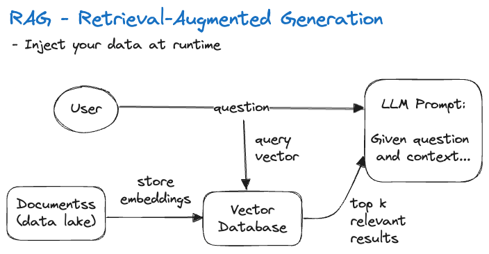
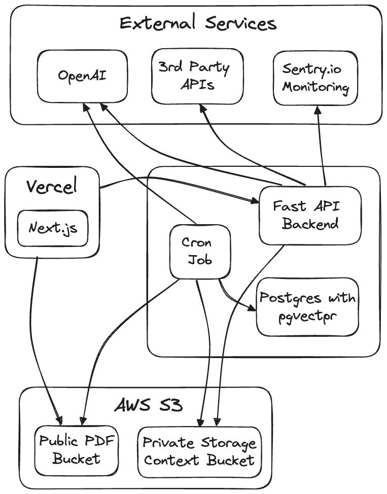

# AI Application Development

- [OpenAI](https://platform.openai.com/docs/introduction)
  - [OpenAI Cookbook](https://github.com/openai/openai-cookbook)
  - [Retrieval Plugin](https://github.com/openai/chatgpt-retrieval-plugin)
  - [Diagrams: Show Me (plugin)](https://github.com/bra1nDump/show-me-chatgpt-plugin)
- [LlamaIndex](https://www.llamaindex.ai/open-source)
- [Hugging Face](https://huggingface.co/)
- [Open LLMs](https://github.com/eugeneyan/open-llms)

## Possible Applications

## People

- [swyx](https://twitter.com/swyx)
- [jerryjliu0](https://twitter.com/jerryjliu0)
- [yoheinakajama](https://twitter.com/yoheinakajima)
