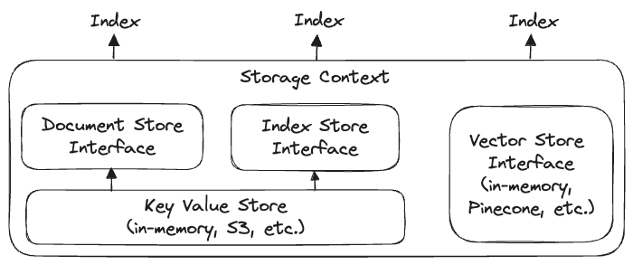

# Learning

## In-Context Learning

User provides model sufficient context using the prompt (e.g. QA/summarization/generation) to use the LLM's reasoning abilities rather than spending time/money to fine-tune/retrain LLM on domain-specific data.

1. **Data Ingestion and Transformation**: Extract, clean, and transform a natural language file into a format that LLM can understand. Isolate most important natural language data and discard irrelevant data (e.g. image cpations, headers/footers, advertisements, etc.)
2. **Data Indexing**: Data structure that can manage underlying data and an interface during query time.

Unstructured is an open source library that helps ingest/preprocess files:

- Offers upstream data connectors, as well as tools to transform filetypes (e.g. PDF, HTML, MSFT office, PNG/JPEG) into JSON/CSV
- Can clean up OCR'd text or scraped web data
- Render files ready for ingestion or an embeddings endpoint downstream
- Detect and classify key doc elements such as body text, lists, headlines

LlamaIndex provides a simple wrapper over Unstructured in order to easily retrieve parsed content and convert it into a format LlamaIndex can ingest.

### Data Indexing

- Combine an embedding-based retrieval model with a language model
- Create "text chunks" from documents
- Create embedding for each chunk
- Store chunks in a vector store (simple in-memory structure or proprietary vector store)
- Create a separate vector store index for each document
- Turn to composability to help answer questions about cross-document queries

### Composing a Graph

- Define a "list" index over each vector store index corresponding to each document
- Querying a list index involves going through every node in the list. This means that every query sent to this graph will go through every subindex (vector store index), and within each subindex, a top-k result will be retrieved.
- LlamaIndex `ComposableGraph`

## Storage

- Document stores (Node objects - ingested document chunks)
- Index stores (index metadata)
- Vector stores (embedding vectors)
- Graph stores (knowledge graphs -> `KnowledgeGraphIndex`)

By default, LlamaIndex uses simple in-memory vector store:

- persist to disk: `vector_store.persist()`
- load from disk: `SimpleVectorStore.from_persist_path(...)`

## Links

- [Building a realtime chat app with Next.js and Vercel](https://ably.com/blog/realtime-chat-app-nextjs-vercel)
- [Publish and Subscribe to Realtime Data on Vercel](https://vercel.com/guides/publish-and-subscribe-to-realtime-data-on-vercel)
