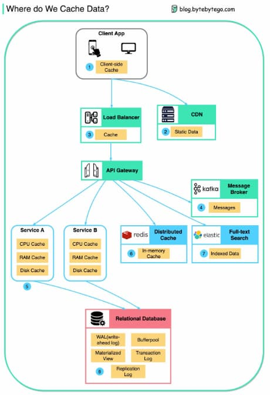

# Microservices

- Pre-Production
  - Define API - this establishes a contract between frontend and backend; can use Postman or OpenAPI for this
  - Development - React is popular for frontend, Java/Python/Go for backend; need to change the configurations in the API gateway according to API definitions
  - Continuous integration - JUnit and Jenkins for automated testing; code is packaged into a Docker image and deployed as microservices
- Production
  - NGinx is a common choice for load balancers
  - Cloudflare provides CDN (Content Delivery Network)
  - API Gateway - can use spring boot for the gateway, and use Eureka/Zookeeper for service discovery
  - microservices are deployed on clouds - AWS, Microsoft Azure, Google GCP
  - Cache and full-text search - Redis is a common choice for caching key-value pairs; ElasticSearch is used for full-text search
  - Communications - can use messaging infra Kafka or RPC for services to talk to each other
  - Persistence - can use MySQL or PostgreSQL for a relational database, Amazon S3 for object store, Cassandra for wide-column store if necessary
  - Management & Monitorng - common ops tools includes Prometheus, Elastic Stack, and Kubernetes

## Modernizing Services

Before modernizing any services, there needs to be a business case for doing so. Often times, there isn't one, or if there is, the gain doesn't justify the cost of modernization.

1. Gather requirements list for if/why the service needs to be modernized.
2. Pick the appropriate technology that meets these requirements (for example, scaling the service or security requirements).
3. Understand the uptime/availability requirements of the service. If you do manage to write a replacement service, how are you going to roll over the new one? Do you upgrade pieces of the old one in place incrementally? Do you do an entire rewrite and then just flip the switch some day?
