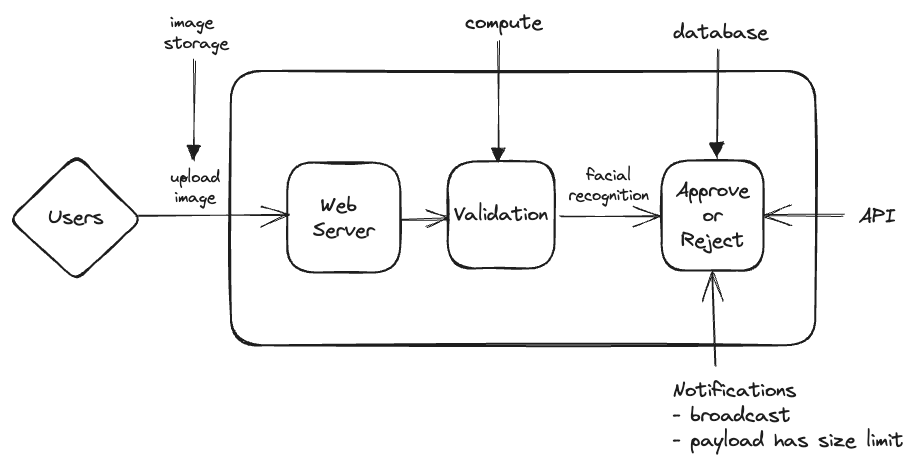
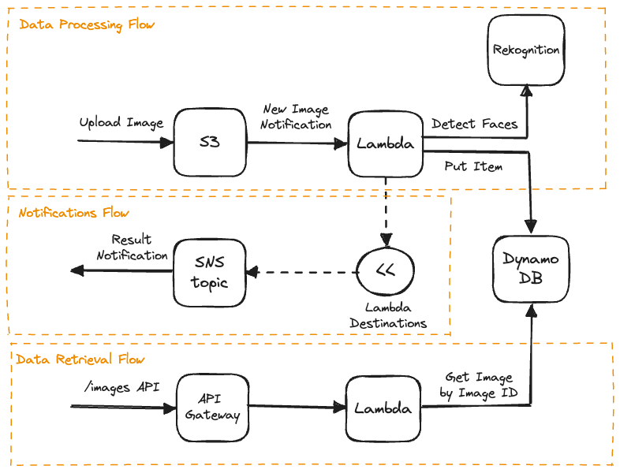

# Example

## Problem

## Core Technology Choices

- Image Storage
  - Needs: Blob file storage
  - Options:
    - EFS (Elastic File System) - Allows you to easily leverage disk drivers onto compute instances
    - **S3** (Simple Storage Service) - Supports large files, small files, and files of varying formats. Integrates well with other AWS seervices and has APIs that support uploading and retrieving data, archiving, event notifications, and many more features.
- Compute
  - Needs: Event processing, API
  - Options:
    - EC2 (Elastic Cloud Compute) - Makes it easy to rent and use servers that are hosted on AWS. EC2 would need to use a polling mechanism to determine when a new file gets uploaded to S3.
    - Fargate - Serverless compute service that sits on top of Amazon Elastic Container Service (ECS). Supports one-off tasks or services that maintain "warm" compute nodes to perform jobs. Good for APIs. Similarly, Fargate would need to use polling to determine when a new file gets uploaded to S3.
    - **Lambda** - Serverless function as a service (FaaS). Lambda lets you focus on your business problem and not have to worry about maintaining your infrastructure. Cold start can be seconds to minutes.
- Facial Recognition
  - Needs: Facial detection and analysis
  - Options:
    - **Rekognition** - Facial detection and analysis service that uses machine learning.
- Database
  - Needs: Key/value record storage
  - Options:
    - RDS (Relational Database Service) - Well suited for use cases that require relations between your data. RDS supports many different types of RDBMS engines such as MySQL, Postgres, Microsoft SQL Server, and more.
    - Aurora - Inhouse developed and maintained RDBMS database buily by AWS. Supports a serverless variation that handles the underlying infrastructure for you. Supports MySQL and Postgres engines.
    - **DynamoDB** - The most popular NoSQL database on AWS. Meant for ultra fast key value lookups that scales seamlessly.
- Notifications
  - Needs: Message publishing
  - Options:
    - SQS (Simple Queue Service) - Distributed queue that persists data for a period of time until the event is processed by another compute layer.
    - Eventbridge - Allows you to leverage a concept called a message bus that supports message publishing and delivery. Can leverage content based filtering to decide which service to route messages to.
    - **SNS** (Simple Notification Service) - Highly scalable pub sub service that is foundational in AWS. Allows you to subscribe clients to a _topic_ to receive updates when the topic owner _publishes_ a message.
- API
  - Needs: Data retrieval
  - Options:
    - AppSync - Managed service for GraphQL users.
    - API Gateway - Offers a rich set of features that allow you to build HTTP or Websocket based APIs. Supports features like authorization, content validation, rate limiting, and more.

## Architecture

