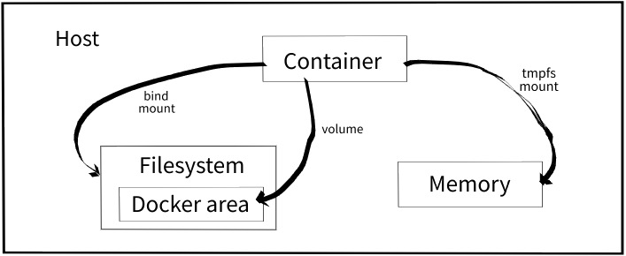

# DevOps

## Docker

- [DevOps with Docker](https://devopswithdocker.com/)
- [docker hub](https://hub.docker.com)
- **container** allows dev to package an app and all its dependencies in a box
  - the underlying host and environment is completely abstracted from the app
  - usually consists of an app running a stripped-to-basics version of a Linux OS
- docker separates apps from infrastructure using container technology similar to how VMs separate the OS from bare metal
  - VMs: app + bins/libs + OS → decreases portability
  - Docker: app + bins/libs (dependencies) → runs as isolated process in userspace on host OS, sharing the kernel with other containers → enjoys resource isolation and allocation benefits of VMs but is much more portable and efficient
- why docker? **microservices** era
- a container is a running instance of an image (the blueprint for a container)



### docker components

- docker daemon: docker engine, runs on host machine → container 1, 2, ...n
- docker client: CLI used to interact with daemon

### docker workflow components

- docker image (like an onion → think layers): holds the env and your app
- docker container: created from images; start, stop, move, delete
- docker registry: public and private repositories used to store images
- dockerfile: automates image constructions; config file that sets up a docker container when you run `docker build` on it

```shell
# stop/remove all containers
docker stop $(docker ps -a -q)
docker rm $(docker ps -a -q)

# prune?
docker image prune

# lifecycle
docker create # creates a container but does not start it
docker rename # allows container to be renamed
docker run # creates and starts a container in one operation
docker run -td container_id # -t pseudo-TTY session, -d detach (run in background)
docker rm # deletes a container
docker rm -v # remove volumes associated with container
docker update # updates a container's resource limits

# map a directory on the host to a docker container
docker run -v $HOSTDIR:$DOCKERDIR

# start/stop container by name by creating it with name
docker run --name yourname docker_image

docker start # starts a container
docker stop # stops a running container
docker restart # stops and starts a container
docker pause
docker unpause
docker kill

# cpu, memmory contraints
docker run -it -c 512
docker run -it --cpuset-cpus=0,4,6
docker run -it -m 300M

docker ps # shows running containers
docker ps -a # shows all containers
docker port # shows public facing port of container
docker stats # shows running containers' resource usage stats
docker stats -a # show all containers' resource usage stats
docker logs
docker inspect

docker exec # execute a command in container
docker exec -it foo /bin/bash

docker images # show all images
docker build # creates image from dockerfile
docker rmi # removes an image

docker history # shows history of an image
docker tag # tags an image to a name (local or registry)
```

### networks

Docker automatically creates 3 network interfaces when you install it (bridge, host, none). A new container is launched into the bridge network by default. To enable communication between multiple containers, you can create a new network and launch containers in it. This enables containers to communicate to each other while being isolated from containers that are not connected to the network. Furthermore, it allows to map container names to their IP addresses.

### registry and repository

A repository is a _hosted_ collection of tagged images that together create the file system for a container.

A registry is a _host_ - a server that stores repositories and provides an HTTP API for managing the uploading and downloading of repositories.

```shell
docker login # login to a registry
docker logout # logout from a registry
docker search # searches registry for image
docker pull # pulls an image from registry to local machine
docker push # pushes an image to the registry from local machine
```

### Using PostgreSQL as a docker container

- [reference](https://medium.com/signofactory/setting-up-your-mac-as-a-full-stack-web-developer-intel-apple-silicon-in-2021-the-backend-9fcc54e858e3)
- [postgres-cheatsheet](https://gist.github.com/Kartones/dd3ff5ec5ea238d4c546)
- `/var/lib/docker/volumes/postgres_data/_data`
- [where is var lib docker on mac](https://stackoverflow.com/questions/38532483/where-is-var-lib-docker-on-mac-os-x)

```shell
docker run -d --name postgres13 \
  -v postgres_data:/var/lib/postgresql/data \
  -e POSTGRES_USER=postgres \
  -e POSTGRES_PASSWORD=postgres \
  -p 5432:5432 \
  postgres:latest
```

- `docker run -d --name postgres13` → run a new container in detached mode (`-d`) with the name of _postgres13_
- `-v postgres_data:/var/lib/postgresql/data` → create a persistent volume (_postgres_data_) that holds the information from _/var/lib/postgresql/data_ on the container; this is necessary so that tables are not wiped every time we restart container
- `-e POSTGRES_USER=postgres` → set up the container user _postgres_ as the main user for the DB
- `-e POSTGRES_PASSWORD=postgres` → same as before, but for the password
- `-p 5432:5432` → map the port 5432 (default for Postgres) from the container to 5432 on your computer (localhost)
- `postgres:latest` → use the latest image from the official postgres registry

```shell
docker exec -it postgres13 bash

psql -U postgres
\l
\du
\q

create database zeus;
create user fantafiction with encrypted password 'password';
grant all privileges on database zeus to fantafiction;

\l
\q

psql -d zeus -U fantafiction
psql -d zeus -U fantafiction -W # prompt for pw

\dt
```

```sql
CREATE TABLE accounts (
  user_id serial PRIMARY KEY,
  username VARCHAR (50) UNIQUE NOT NULL,
  password VARCHAR (50) NOT NULL,
  email VARCHAR (255) UNIQUE NOT NULL,
  created_on TIMESTAMP NOT NULL,
  last_login TIMESTAMP
);

CREATE TABLE roles (
  role_id serial PRIMARY KEY,
  role_name VARCHAR (255) UNIQUE NOT NULL
);

CREATE TABLE account_roles (
  user_id INT NOT NULL,
  role_id INT NOT NULL,
  grant_Date TIMESTAMP,
  PRIMARY KEY (user_id, role_id),
  FOREIGN kEY (role_id)
    REFERENCES roles (role_id),
  FOREIGN KEY (user_id)
    REFERENCES accounts (user_id)
);
```

### Using MongoDB as a docker container

[reference](https://www.thepolyglotdeveloper.com/2019/01/getting-started-mongodb-docker-container-deployment/)

```shell
# hub.docker.com → check version to pull
docker pull mongo:4.2-bionic

# run container in detached mode
# note port mapping is only necessary if you wish to use from host computer
# if you plan to deploy all your apps as micro-services with Docker,
# then you'd be fine as long as your containers can communicate with each other
docker run -d -p 27017-27019:27017-27019 --name mongodb mongo:4.2-bionic

# interact with MongoDB docker container with basic shell operations
docker exec -it mongodb bash

mongo
show dbs
use zeus
db.users.save({ username: "fantafiction" })
db.users.find({ username: "fantafiction" })
```

```shell
docker ps
docker start mongodb
docker stop mongodb
```
